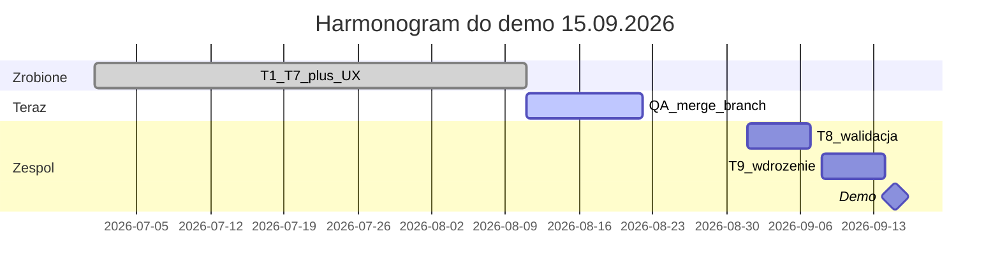

# Co teraz — stan projektu i kolejne kroki

## Gdzie jesteśmy (11.08.2026)

**Zrobione w kodzie (branch `[cursor/ux-polish-pl](D:/ja/TY100/Zadanie1/crossdock)`, +2 commity względem `master`):**

| Tydzień   | Zakres                                                | Status                          |
| --------- | ----------------------------------------------------- | ------------------------------- |
| T1–T3     | Szkielet, import Excel, solver, mapa                  | done                            |
| T4        | Pulpit KPI, kolejka, skróty                           | done                            |
| T5        | Plany, porównanie, akceptacja                         | done                            |
| T6        | Raporty Excel, koszty (placeholdery)                  | done                            |
| T7        | Buforowanie, `/system`, backup                        | done                            |
| UX polish | PL etykiety, motyw, ustawienia runtime, strzałki mapy | done                            |
| Ops Focus | Top nav (pills), wspólny chrome na stronach, login    | done (wymaga QA w przeglądarce) |

**Niezacommitowane lokalnie:** tylko śmieci (`dane/`, `.cursor/`, skrypty pomocnicze) — nie dotykają aplikacji.

---

## Otwarte plany (z dokumentacji)

### T8 — Walidacja z zespołem (1–7.09) — `[docs/plan_tworzenia_aplikacji.md](docs/plan_tworzenia_aplikacji.md)`

- Import **pełnych** plików Excel od Patryka (W-01) — w repo są już pliki w `[dane/](dane/)` i fixture `[tests/fixtures/carrier_load_status1620780.xlsx](tests/fixtures/carrier_load_status1620780.xlsx)`, ale nie są jeszcze w git.
- **Golden scenario** (W-07): jeden tydzień + oczekiwany wynik optymalizacji → test regresyjny solvera.
- **Strojenie solvera** z dyspozytorami: progi zapełnienia, max dropów, czas solvera.
- **Stawki Sandry** (W-06) zamiast placeholderów w `[crossdock/config.py](crossdock/config.py)` i `[data/runtime_settings.json](data/runtime_settings.json)`.

### T9 — Wdrożenie i próba demo (8–14.09)

- Instalacja na docelowym PC (LAN, SQLite, `.env`).
- Zestaw danych demo + scenariusz prezentacji (krok po kroku: import → plan → mapa → raport).
- Opcjonalnie (stretch): OSRM zamiast haversine w `[crossdock/distance/](crossdock/distance/)`.

### Blokady zespołowe — `[docs/otwarte_wejscia_zespolu.md](docs/otwarte_wejscia_zespolu.md)`

| ID   | Kto                   | Co blokuje                    |
| ---- | --------------------- | ----------------------------- |
| W-01 | Patryk                | Pełne Excele tygodniowe       |
| W-02 | Sandra                | Słownik kolumn Excel          |
| W-03 | Martyna               | Tabela floty (pojemności)     |
| W-04 | Firma                 | Liczba palet w danych         |
| W-06 | Sandra                | Stawki kosztowe / buforowanie |
| W-07 | Patryk + dyspozytorzy | Golden scenario               |

Bez W-06/W-07 aplikacja **działa**, ale koszty i testy regresyjne będą na placeholderach.

---

## Natychmiastowe kroki techniczne (przed T8)

Te rzeczy nie wymagają danych od zespołu i warto je domknąć w ciągu ~1–2 dni:

### 1. QA wizualne Ops Focus

- Uruchomić `uv run crossdock`, twarde odświeżenie (Ctrl+F5).
- Sprawdzić wszystkie 8 tras: `[crossdock/ui/pages.py](crossdock/ui/pages.py)` + `[crossdock/ui/layout.py](crossdock/ui/layout.py)` + `[crossdock/ui/ops_dashboard.py](crossdock/ui/ops_dashboard.py)`.
- Porównać z [Concept B (Ops Focus)](https://www.magicpatterns.com/inspiration/e61eedc9-94e1-4733-9a05-0b0c623039f0).

### 2. Drobne poprawki UX (jeśli QA coś ujawni)

- Usunąć **zdublowane nagłówki** na podstronach (np. Plany, Raporty — `ops_page_header()` + stary hero).
- **Sweep UTF-8** w `pages.py` (edycje polskich stringów tylko przez Python `pathlib`, nie PowerShell/StrReplace na Windows).
- Ujednolicić spacing kart (`.cd-ops-panel`, `.cd-shell` max-width 1100px).

### 3. Merge brancha do `master`

- Po QA: PR z `cursor/ux-polish-pl` → `master` (2 commity: UX polish + Ops Focus).
- Smoke: `uv run pytest -q`, ręczny walkthrough z `[docs/walkthrough_ux_polish.md](docs/walkthrough_ux_polish.md)`.

### 4. Przygotowanie pod T8 (równolegle z danymi od zespołu)

- Dodać fixture Excel do repo (bez wrażliwych danych produkcyjnych) + test importu na `[carrier_load_status*.xlsx](dane/)`.
- Szkielet **golden test** solvera (pusty/plACEHOLDER do czasu W-07).
- Checklist demo: jeden plik markdown ze scenariuszem 15-min prezentacji.

---

## Rekomendowany wybór „co teraz”

**Jeśli chcesz kontynuować kod:** najpierw **QA + merge** brancha UX, potem **T8 prep** (fixture importu + golden test skeleton).

**Jeśli czekasz na zespół:** można iść równolegle na **scenariusz demo** i **packaging T9** (skrypt startu, `.env.example`, instrukcja instalacji LAN).

**Jeśli UI nadal „nie wygląda jak mockup”:** priorytet to sesja QA w przeglądarce z listą konkretnych rozjazdów — wtedy targeted fix w `layout.py` / `ops_dashboard.py`, nie kolejna pełna przebudowa.

---

## Plany już wykonane (nie powtarzać)

- `ux_polish_pl_aed1d48c` — etykiety PL, motyw, T4–T7 flows, raporty, mapa
- `ops_focus_all_pages_c47f504b` — top nav, wspólny chrome, login (commit `3d0dbda`)

Todos z tych planów są **zamknięte**.