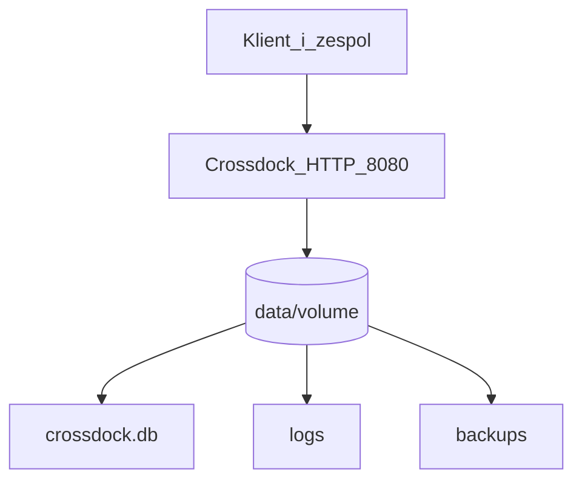

# Hosting demo — Docker Compose na Oracle VM

Tymczasowe środowisko do prezentacji aplikacji klientowi i członkom zespołu.
Nie zastępuje docelowego wdrożenia LAN u klienta.

## Co powstało

- `Dockerfile` — obraz aplikacji `crossdock`
- `docker-compose.yml` — uruchomienie serwera na porcie `8080`
- `docker/entrypoint.sh` — przygotowanie `data/`, migracje Alembica i start aplikacji
- `deploy/.env.demo.example` — szablon zmiennych środowiskowych pod serwer demo

Równoległe testy 4 osób (osobne bazy, porty 8081–8084):
[`docs/hosting_testers.md`](hosting_testers.md) + `docker-compose.testers.yml`.

## Architektura fazy 1



Domyślnie aplikacja działa na providerze odległości haversine.
OSRM (trasy drogowe) jest opcjonalny — osobny plik [`docker-compose.osrm.yml`](../docker-compose.osrm.yml)
z profilem `osrm` i preprocessed datasetem Belgii w `data/osrm/`.
Szczegóły: [`docs/osrm_local.md`](osrm_local.md).

```bash
# OSRM lokalnie (wymaga gotowych plików *.osrm w data/osrm/)
docker compose -f docker-compose.osrm.yml --profile osrm up -d

# Aplikacja + OSRM w jednej sieci Compose
docker compose -f docker-compose.yml -f docker-compose.osrm.yml --profile osrm up -d --build
```

W `.env` ustaw wtedy:

```text
CROSSDOCK_USE_OSRM=true
CROSSDOCK_OSRM_URL=http://osrm:5000
CROSSDOCK_OSRM_PROFILE=driving
```

Gdy aplikacja działa na hoście, a OSRM w Dockerze: `CROSSDOCK_OSRM_URL=http://127.0.0.1:5000`.

## Uwagi o bazie SQLite w volume

W Dockerze mountujemy `./data` jako trwały storage.

- **Oracle VM / Linux:** użyj `CROSSDOCK_DB_PATH=data/crossdock.db` w `.env` serwera (domyślnie w [`deploy/.env.demo.example`](../deploy/.env.demo.example)).
- **Windows + Docker Desktop:** jeśli lokalny `./data/crossdock.db` jest zablokowany przez proces na hoście, ustaw w `.env` osobną ścieżkę, np. `CROSSDOCK_DB_PATH=data/demo/crossdock_demo.db` — bez hardcodowania w `docker-compose.yml`.

## Wymagania VM

- Oracle Cloud Always Free VM
- Ubuntu 24.04
- publiczny adres IP
- otwarty port `8080` w regułach sieci

## Przygotowanie serwera

1. Połącz się przez SSH.
2. Zainstaluj Docker Engine oraz Docker Compose plugin.
3. Sklonuj repozytorium na serwer.
4. W katalogu projektu utwórz katalog `data/`:

```bash
mkdir -p data
```

5. Skopiuj szablon środowiska i uzupełnij sekrety:

```bash
cp deploy/.env.demo.example .env
```

Najważniejsze pola:

- `CROSSDOCK_STORAGE_SECRET`
- `CROSSDOCK_ADMIN_PASSWORD`
- opcjonalnie `CROSSDOCK_SOLVER_TIME_LIMIT_S`, jeśli VM okaże się wolniejsza

## Start aplikacji

```bash
docker compose up -d --build
```

Podczas startu kontener:

1. tworzy `data/`, `data/logs/`, `data/backups/`
2. uruchamia `uv run alembic upgrade head`
3. startuje `uv run crossdock`

## Adres aplikacji

Po starcie aplikacja będzie dostępna pod:

```text
http://PUBLIC_IP:8080
```

## Smoke test po wdrożeniu

1. Otwórz `/login`
2. Zaloguj się kontem `admin`
3. Zaimportuj `tests/fixtures/przykładowe_dane_od_firmy.xlsx`
4. Wygeneruj plan
5. Sprawdź mapę, magazyn i raporty

## Przydatne komendy

```bash
docker compose ps
docker compose logs -f crossdock
docker compose restart crossdock
docker compose down
```

## Uwagi

- Dane są trwałe dzięki mountowi `./data:/app/data`.
- Plik `config/excel_column_mapping.json` jest montowany tylko do odczytu przez `./config:/app/config:ro`.
- Backup nocny dalej działa, bo scheduler startuje w `crossdock/__main__.py`.
- Na demo to wystarczy; HTTPS i reverse proxy można dołożyć później jako osobny etap.
