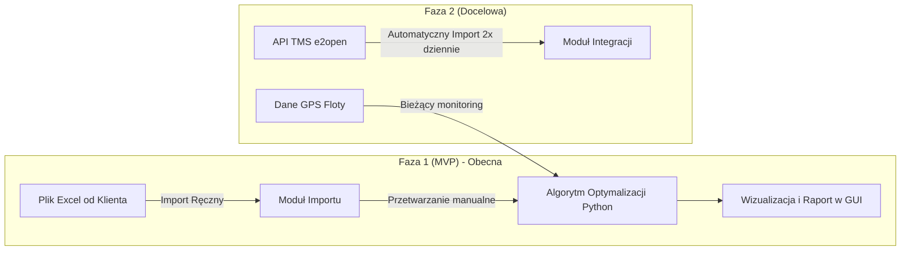

# Karta Projektu i Plan Wdrożenia

> [!IMPORTANT]
> Niniejszy dokument stanowi centralne źródło prawdy (Source of Truth) dla zespołu projektowego i łączy kluczowe informacje techniczne oraz logistyczne. Służy do koordynacji prac projektowych i implementacji oprogramowania.

---

## 1. Metadane Projektu & Dane Dostępowe

| Parametr | Szczegóły |
| :--- | :--- |
| **Nazwa Projektu** | System optymalizacji cross-dockingu w logistyce transportowej |
| **Technologia** | Python (preferowany język implementacji algorytmów i backendu) |
| **System Klienta** | TMS e2open |
| **Portal Klienta (URL)** | [Logowanie TMS e2open](https://na-app.tms.e2open.com/security/login.do?messageKey=logout.successful&loginPageAction=changeLanguage&defaultLanguage=ENGLISH_US&temporaryDefaultLanguage=true) |
| **Dane logowania** | przechowywane poza dokumentacją (u lidera zespołu) — nie wersjonować danych dostępowych |

---

## 2. Infrastruktura Logistyczna (Parametry Operacyjne)

Na podstawie komunikacji z klientem zdefiniowano następujące parametry fizyczne i operacyjne sieci logistycznej:

### Magazyn Załadunkowy (Nadawca)
* **Nazwa:** Hargo Logistics
* **Adres:** Scheldelaan 373, 2030 Antwerpen, Belgia
* **Pojemność/Powierzchnia:** 5 jednostek – łącznie 41 700 m²
* **Wydajność operacyjna:** ~50 zestawów (ciężarówek) dziennie

### Nasz Magazyn Przeładunkowy (Cross-Docking / Własny)
* **Nazwa:** Antwerp Warehousing Partners
* **Adres:** Grensstraat 3, 2200 Herentals, Belgia (~30 km od Antwerpii)
* **Pojemność/Powierzchnia:** 7 000 m²
* **Wydajność operacyjna:** ~30 zestawów (ciężarówek) dziennie
* **Możliwości:** Rotacja paczek oraz czasowe buforowanie (kolejkowanie) przesyłek drobnicowych.

---

## 3. Struktura Zespołu & Podział Ról

Projekt realizowany jest przez zespół akademicko-wdrożeniowy o komplementarnych kompetencjach:

| Członek Zespołu | Rola Projektowa | Kluczowy Obszar Odpowiedzialności |
| :--- | :--- | :--- |
| **Seweryn** (Informatyka) | Lider Zespołu / Architekt IT | Odpowiedzialny za architekturę systemu, implementację algorytmów optymalizacyjnych w Pythonie, zarządzanie kodem i koordynację zespołu. |
| **Patryk** (Logistyka / mgr) | Specjalista ds. Symulacji | Modelowanie logistyczne procesów cross-dockingu, projektowanie i przeprowadzanie symulacji tras oraz weryfikacja poprawności algorytmów. |
| **Sandra** (Ekonomia / logistyka) | Analityk Finansowo-Biznesowy | Opracowanie modeli kosztowych (rentowność FTL vs LTL, koszty magazynowania w Herentals), zdefiniowanie wskaźników KPI oraz analiza opłacalności kolejkowania. |
| **Martyna** (Logistyka, 2 rok) | Specjalista ds. Danych & Dokumentacji | Przygotowanie danych testowych w formacie Excel, walidacja poprawności struktury danych wejściowych, wsparcie operacyjne i koordynacja spotkań. |

---

## 4. Strategia Implementacji (Architektura & Fazy)

W związku z oczekiwaniem na dostęp do API ze strony działu IT klienta, wdrożenie podzielono na dwie kluczowe fazy:

### Faza 1: MVP (Wersja Robocza)
* **Źródło danych:** Ręczny import danych z arkusza Excel pobieranego z portalu e2open.
* **Wyzwalanie:** Manualne z poziomu aplikacji.
* **Zakres algorytmu:** Konsolidacja przesyłek (shipments) należących do jednego zlecenia (min. 2 numery shipment bez rozdzielania), planowanie tras FTL, optymalizacja tras dla floty (busy, ciężarówki, plandeki).
* **Cel:** Weryfikacja działania algorytmu optymalizacyjnego na rzeczywistych danych.

### Faza 2: Integracja Pełna
* **Źródło danych:** Bezpośrednia integracja API z systemem TMS e2open (dane pobierane automatycznie) + pobieranie danych GPS pojazdów.
* **Harmonogram:** Automatyczny import 2 razy dziennie w oknach czasowych: 5:30 - 6:00 oraz 11:30 - 12:00.
* **Cel:** Bezobsługowe działanie w środowisku produkcyjnym dyspozytorów.

---

## 5. Kamienie Milowe Wdrożenia

> Aktualny stan kodu (13.08.2026): [`stan_projektu.md`](stan_projektu.md). Faza 1 (Excel → solver → GUI) jest zaimplementowana przez T7. Faza 2 (API, GPS) bez zmian — czeka na IT klienta.

* **Krok 1: Prace przygotowawcze:** Setup Python, pierwszy Excel z e2open — **zrobione**.
* **Krok 2: Algorytm MVP:** Grupowanie FTL, trasy, mapa, raporty, magazyn — **zrobione w kodzie**; stawki Sandry i golden Patryka nadal placeholdery.
* **Krok 3: Integracja z API i testy produkcyjne:** po powrocie IT klienta (poza harmonogramem do 15.09).

