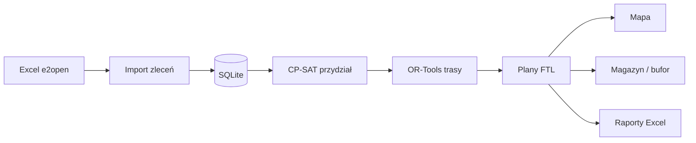

# Stan projektu — 13.08.2026

> **To jest aktualny obraz systemu.** Harmonogram tygodniowy (`plan_tworzenia_aplikacji.md`) i walkthrough T1–T7 zostają jako historia tygodni — nie opisują już „gdzie jesteśmy”.
>
> Kalendarz planu: trwa **T5** (11–17.08). Kod jest **do przodu o T6–T7** plus zatwierdzanie pojedynczych tras i polish UI.

Powiązane: [`notatka_srs.md`](notatka_srs.md) (wymagania), [`stack_technologiczny.md`](stack_technologiczny.md) (decyzje), [`otwarte_wejscia_zespolu.md`](otwarte_wejscia_zespolu.md) (dane od zespołu), [`karta_projektu_i_wdrozenia.md`](karta_projektu_i_wdrozenia.md) (infrastruktura, role).

---

## 1. Co to jest

Aplikacja LAN (local-first) dla dyspozytorów: **Excel → plan FTL → mapa → raport / magazyn**.
Klient: Hargo / TMS e2open. Magazyn przeładunkowy: Antwerp Warehousing Partners, Herentals.

Uruchomienie:

```powershell
uv sync
uv run alembic upgrade head
uv run crossdock
```

Logowanie: konto `admin` z `CROSSDOCK_ADMIN_PASSWORD` w `.env`. UI po polsku.

---

## 2. Jak działa (przepływ)



1. **Zlecenia** — ręczny import `.xlsx` (format e2open, nagłówek w wierszu 3). Wiersze z tym samym kodem dostawy = jedno zlecenie (FR-019: shipmenty jadą razem).
2. **Plany FTL** — solver w osobnym procesie (`run.cpu_bound`, limit ~45 s, ziarno 42). Najpierw przydział zleceń do pojazdów (CP-SAT, pojemność **kg + palety**), potem kolejność dropów (Routing Solver, max. 3 punkty, min. km). Palety: szacunek warstwowy (towar / typ pojazdu / default z Parametrów) — kolumny palet w Excelu nie ma i nie planujemy.
3. **Zatwierdzanie przyrostowe** — można zatwierdzić jedną trasę; pojazd staje się zajęty; kolejne „Generuj” dopełnia wolne auta i nowe zlecenia.
4. **Mapa** — linie proste magazyn → dropy (haversine, nie sieć drogowa).
5. **Magazyn** — ręczna kolejka wydań + propozycja „wyślij teraz vs przytrzymaj” (stawki orientacyjne).
6. **Raporty** — zapełnienie wagowe i oszczędność vs scenariusz 1 zlecenie = 1 pojazd.

Odległości: wyłącznie linia prosta. Port `DistanceProvider` jest gotowy na OSRM (niezaimplementowane).

---

## 3. Co jest zrobione

### Tygodnie planu

| Tydzień | Cel | Stan w kodzie |
| :--- | :--- | :--- |
| T1 | Fundament, logowanie, FR-019/024 | **zrobione** |
| T2 | Import Excel, flota, haversine | **zrobione** |
| T3 | CP-SAT przydział | **zrobione** |
| T4 | Trasy, plan w UI, zatwierdzanie | **zrobione** |
| T5 | Mapa Leaflet | **zrobione** |
| T6 | Raporty, kolejka, edycja palet | **zrobione** (kalendarz: 18–24.08) |
| T7 | Buforowanie, `/system`, backup | **zrobione** (kalendarz: 25–31.08) |
| T8 | Walidacja z zespołem, golden | **nie** — czeka na Patryka/Sandrę |
| T9 | Instalacja na PC demo, próba | **nie** — od 8.09 |

### Poza oryginalnym tygodniem (już w aplikacji)

- Zatwierdzanie **pojedynczych tras** i flota `zajęty/wolny` (demo weekly).
- Pulpit operacyjny, motyw jasny/ciemny (bez błysku), font Inter (self-hosted), polskie znaki.
- Tabele: kolumna checkbox + **Powiększ**.
- Wyjaśnienia stron schowane pod przyciskiem „i”.
- Szacunek palet warstwowy (`domain/pallet_estimate.py`) — **wchodzi do CP-SAT** (obok kg). Hierarchia: nadpisanie na zleceniu → kg/paleta typu pojazdu → default z Parametrów.
- Pojemności floty z `config/fleet_seed.json` (W-03 DONE); liczba aktywnych per typ w UI (seed 2/4/8 to start, nie cel 130).
- Stawki z Ustawienia → Parametry (`data/runtime_settings.json`, W-06 DONE).

### Ekrany

| Strona | Ścieżka | Co robi |
| :--- | :--- | :--- |
| Pulpit | `/` | Ostatni plan, Jedzie / Zostaje / Wymaga uwagi, KPI, skróty |
| Zlecenia | `/orders` | Import Excel, tabela, usuwanie, gęstość/palety towaru (także status „nowe”) |
| Plany FTL | `/plans` | Generowanie, chipy statusu, flota, trasy, zatwierdzanie/odblokowanie |
| Mapa | `/map` | Leaflet, kolory per pojazd, strzałki kierunku |
| Magazyn | `/warehouse` | Kolejka + propozycja bufora |
| Raporty | `/reports` | Zapełnienie, oszczędności, eksport `.xlsx` |
| Stan systemu | `/system` | Baza, logi, backup ręczny / nocny |
| Ustawienia | `/settings` | Flota, lokalizacje, progi i stawki (bez haseł) |
| Logowanie | `/login` | Argon2, sesja, timeout bezczynności |

Role `admin` / `dispatcher` / `viewer` są w modelu — **UI sprawdza tylko „zalogowany”**, nie rozróżnia ról.

---

## 4. Wymagania vs kod

Kolumna „Status” w SRS oznacza **potwierdzenie wymagania**, nie implementację. Poniżej: stan kodu.

| ID | Stan | Uwagi |
| :--- | :--- | :--- |
| FR-001 | **brak** | API TMS e2open — blokada IT klienta (po 15.09) |
| FR-002 | **częściowo** | Excel e2open działa; drugi format TMS (funty, 25 kolumn) nie |
| FR-003, 005, 006, 007 | **jest** | Kod, waga kg, adresy, termin |
| FR-004 | **jest** | Szacunek warstwowy (towar / typ pojazdu / default); kolumna Excela nieplanowana; haczyk w mapowaniu zostaje |
| FR-008 | **częściowo** | Grupowanie przez solver z depotu; brak osobnego etapu „cross-dock” |
| FR-009 | **jest** | FTL z ograniczeniami kg i floty |
| FR-010 | **częściowo** | Geografia = haversine, nie drogi |
| FR-011 | **jest** | Zapełnienie wagowe + paletowe (względem pojazdu na trasie) |
| FR-012 | **jest** | Limit punktów rozładunku (domyślnie 3) |
| FR-013 | **częściowo** | Kierunek tylko pośrednio (min. km), bez sektorów |
| FR-014 | **jest** | Min. km (linia prosta) |
| FR-015 | **częściowo** | Koszt = km × stawka z Parametrów (W-06 DONE); koszt nie jest celem solvera |
| FR-016 | **jest** | Mapa; linie proste |
| FR-017, 018 | **jest** | Raport Excel; stawki z Parametrów |
| FR-019 | **jest** | Niezmiennik w domenie + solver + testy |
| FR-020 | **jest** | Kolejka ręczna (góra/dół/wstrzymaj) |
| FR-021 | **jest** | Gęstość/palety na zleceniu (także „nowe”); przy przepełnieniu na zatwierdzonym — ostrzeżenie, bez ponownego planu |
| FR-022 | **jest** | Heurystyka na stawkach z Parametrów; palety = warstwa 1 albo default (warstwa 3) |
| FR-023 | **brak** | Brak automatycznego planu 4–5 dni przed wysyłką |
| FR-024 | **jest** | Domyślnie +7 dni |
| NFR-001 | **częściowo** | Import ręczny (zgodnie z MVP); harmonogram 5:30/11:30 czeka na API |
| NFR-002, 003 | **częściowo** | Plik Excel; API nie |
| NFR-004 | **częściowo** | UI pod dyspozytora jest; brak formalnego odbioru UX |
| NFR-005 | **częściowo** | Solver poza UI, WAL; brak twardych SLA w testach |
| NFR-006 | **brak** | Brak metryki CO₂ (tylko mniej km) |

---

## 5. Czego nie ma i dlaczego

| Brak | Dlaczego | Kiedy |
| :--- | :--- | :--- |
| API e2open + import 5:30/11:30 | Czeka dział IT klienta | Po 15.09 (Faza 2) |
| OSRM (trasy drogowe) | Stretch T9; port gotowy | Jeśli starczy czasu przed pokazem, inaczej po demo |
| GPS floty | Brak źródła danych | Faza 2 |
| Golden test „dobry plan” | Brak scenariusza Patryka (W-07) | T8 |
| Oficjalny słownik kolumn | Empiryczne mapowanie; czeka potwierdzenie (W-02) | gdy Sandra potwierdzi |
| Drugi format Excela (funty) | Świadomie poza T2 | Później, osobne mapowanie |
| Egzekwowanie ról w UI | Model jest, ekrany wspólne | Może przed demo, nie blokuje |
| Autostart na PC docelowym | T9 | 8–14.09 |

---

## 6. Co powinno być zrobione (do pokazu 15.09)

Kolejność: najpierw to, bez czego demo kuleje albo zespół nie może potwierdzić planu.

1. **QA UI i merge** — Polish, motyw, Plany FTL, Powiększ, checkboxy; odbiór wizualny na 8 stronach.
2. **T8 z zespołem** — jeden tydzień z `dane/carrier_load_status *.xlsx` + oczekiwany wynik (W-07); strojenie progów (zapełnienie, max dropów, czas solvera).
3. **Flota demo** — ustalić liczby bus/truck/plandeka na pokaz w UI (nie 130).
4. **T9** — instalacja LAN na PC, konta, scenariusz 15 min: import → plan → zatwierdź trasę → mapa → raport.

Ścieżka krytyczna na pokaz: **Excel → plan → mapa → logowanie**. To już działa.

---

## 7. Co może być zrobione (nie blokuje pokazu)

- OSRM w Dockerze (realne km i linie na mapie).
- Automatyczne generowanie planu z wyprzedzeniem 4–5 dni (FR-023).
- Role w UI (viewer tylko podgląd).
- Drugi parser Excela (format TMS w funtach).
- Metryka CO₂ z km.
- Geokodowanie (Photon) zamiast ręcznego słownika miast.
- Testy wydajności na pełnym `dane_01.04–31.07.2026.xlsx`.

Gdyby tnąć zakres (z planu): OSRM → FR-022 → FR-020 → FR-021 → raporty. Mapa i logowanie **nie** do cięcia.

---

## 8. Architektura (skrót)

Warstwy: `ui → services → domain/optimization`. Solver nie importuje I/O.

| Katalog | Rola |
| :--- | :--- |
| `crossdock/domain/` | Modele, FR-019/024, szacunek palet |
| `crossdock/optimization/` | CP-SAT, routing, heurystyka bufora (DTO pickle) |
| `crossdock/distance/` | Port + haversine |
| `crossdock/ingest/` | Port + Excel |
| `crossdock/storage/` | SQLAlchemy, repozytoria |
| `crossdock/services/` | Przypadki użycia |
| `crossdock/ui/` | NiceGUI |
| `config/` | Mapowanie Excela, seed floty, współrzędne |
| `alembic/versions/` | 7 migracji, head: `f6a7b8c9d0e1` |

Baza: `users`, `orders`, `shipments`, `vehicles`, `location_coords`, `assignment_runs`, `assignment_items`, `assignment_routes`, `warehouse_queue`, `audit_log`.

---

## 9. Dane i konfiguracja

| Źródło | Gdzie | Uwaga |
| :--- | :--- | :--- |
| Import docelowy | `tests/fixtures/przykładowe_dane_od_firmy.xlsx` + weekly w `dane/` | e2open, kg, nagłówek wiersz 3 |
| Flota | `config/fleet_seed.json` + `dane/FLota.xlsx` | bus 8 pal. / 1050 kg; naczepa i plandeka 33 / 24 500 kg |
| Współrzędne | `config/location_coords_seed.json` | ręczne; brak = „Wymaga uwagi” |
| Stawki, progi, kg/paleta | Ustawienia → Parametry / Flota (`data/runtime_settings.json`) | W-06 DONE; wzór palet bez edycji kodu |
| Sekrety | `.env` | nie w gicie |

Folder `dane/` jest roboczy (Drive zespołu) — nie commituj haseł TMS.

---

## 10. Mapa dokumentacji

| Czytać gdy | Plik |
| :--- | :--- |
| **Gdzie jesteśmy teraz** | ten plik |
| Harmonogram 14.07–15.09 | [`plan_tworzenia_aplikacji.md`](plan_tworzenia_aplikacji.md) |
| Wymagania FR/NFR | [`notatka_srs.md`](notatka_srs.md) |
| Stack i odrzucone opcje | [`stack_technologiczny.md`](stack_technologiczny.md) |
| Dane od Patryka/Sandry/Martyny | [`otwarte_wejscia_zespolu.md`](otwarte_wejscia_zespolu.md) |
| Magazyny, zespół, fazy | [`karta_projektu_i_wdrozenia.md`](karta_projektu_i_wdrozenia.md) |
| Reguły dla AI w repo | [`../AGENTS.md`](../AGENTS.md) |
| Historia tygodnia N | `walkthrough_tN.md` + `plan_tN_implementacja.md` (nie aktualizować wstecz) |
| Demo weekly | [`walkthrough_incremental_routes.md`](walkthrough_incremental_routes.md) |
